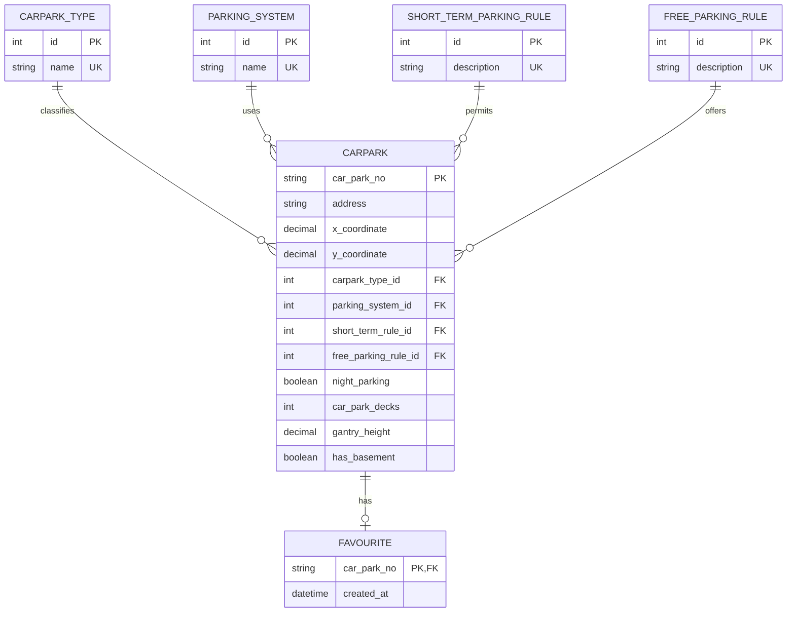

# Carpark Info API

ASP.NET Core 6 Web API implementation for the HDB carpark information assignment.

## Tech Stack

- ASP.NET Core 6
- Entity Framework Core 6
- SQLite
- Swagger/OpenAPI
- xUnit

## Prerequisites

Install the .NET 6 SDK before running or testing the project:

```text
https://dotnet.microsoft.com/en-us/download/dotnet/6.0
```

Verify that the SDK is available:

```powershell
dotnet --list-sdks
```

You should see a `6.0.x` SDK version. If the command says `No .NET SDKs were
found`, only the runtime is installed and `dotnet run` / `dotnet test` will not
work.

On the development machine used for this submission, the SDK was installed in
the user profile. If `dotnet` does not work but this path exists, use:

```powershell
C:\Users\tanle\.dotnet\dotnet.exe
```

For example:

```powershell
C:\Users\tanle\.dotnet\dotnet.exe run --project .\src\CarparkInfo.Api\CarparkInfo.Api.csproj
```

## Run

```powershell
cd CarparkInfoApi
dotnet run --project .\src\CarparkInfo.Api\CarparkInfo.Api.csproj
```

Swagger is available at:

```text
https://localhost:<port>/swagger
```

## Import CSV

The import is transactional. If any row fails validation, the entire file is
rolled back.

Place the supplied CSV file in a local `data` folder:

```text
CarparkInfoApi/
  data/
    hdb-carpark-information-20220824010400.csv
```

```powershell
dotnet run --project .\src\CarparkInfo.Api\CarparkInfo.Api.csproj -- --import ".\data\hdb-carpark-information-20220824010400.csv"
```

The same import service is also exposed through the API:

```http
POST /api/imports/carparks?filePath=.\data\hdb-carpark-information-20220824010400.csv
```

## Testing With Swagger

Use this method when you want to manually test the API in a browser.

### 1. Start the API

```powershell
cd CarparkInfoApi
dotnet run --project .\src\CarparkInfo.Api\CarparkInfo.Api.csproj
```

The terminal will show the local URLs used by the API, for example:

```text
Now listening on: https://localhost:7xxx
Now listening on: http://localhost:5xxx
```

Open Swagger in your browser by adding `/swagger` to the HTTPS URL:

```text
https://localhost:7xxx/swagger
```

If the browser shows a local development certificate warning, continue to the
site. This is normal for local ASP.NET Core development.

### 2. Import the CSV

Before searching carparks, load the provided dataset.

In Swagger:

1. Open `POST /api/imports/carparks`.
2. Click `Try it out`.
3. Enter this value for `filePath`:

```text
.\hdb-carpark-information-20220824010400.csv
```

4. Click `Execute`.

Expected result:

```json
{
  "rowsImported": 2181
}
```

If Swagger returns `400 Bad Request`, check that the CSV file path is correct.
The import runs inside one database transaction, so a failed import will not
partially save rows.

### 3. Test carpark filtering

In Swagger:

1. Open `GET /api/carparks`.
2. Click `Try it out`.
3. Use these sample query values:

```text
hasFreeParking: true
hasNightParking: true
minimumVehicleHeight: 2.1
```

4. Click `Execute`.

Expected result:

- Status code `200`
- Response body contains a JSON array of carparks
- Each returned carpark has a non-`NO` `freeParking` value
- Each returned carpark has `nightParking` set to `true`
- Each returned carpark has `gantryHeight` greater than or equal to `2.1`

### 4. Test global favourites

Use an existing carpark number from the imported data, such as `ACM`.

Add a favourite:

1. Open `POST /api/favourites/{carParkNo}`.
2. Click `Try it out`.
3. Enter:

```text
ACM
```

4. Click `Execute`.

Expected result:

```text
204 No Content
```

List favourites:

1. Open `GET /api/favourites`.
2. Click `Try it out`.
3. Click `Execute`.

Expected result:

- Status code `200`
- Response body contains `ACM`

Remove the favourite:

1. Open `DELETE /api/favourites/{carParkNo}`.
2. Click `Try it out`.
3. Enter:

```text
ACM
```

4. Click `Execute`.

Expected result:

```text
204 No Content
```

### 5. Test invalid favourite handling

In Swagger:

1. Open `POST /api/favourites/{carParkNo}`.
2. Click `Try it out`.
3. Enter:

```text
UNKNOWN
```

4. Click `Execute`.

Expected result:

```text
404 Not Found
```

## API

### Search carparks

```http
GET /api/carparks?hasFreeParking=true&hasNightParking=true&minimumVehicleHeight=2.1
```

Filters:

- `hasFreeParking`: when `true`, excludes rows where `free_parking` is `NO`
- `hasNightParking`: matches the `night_parking` flag
- `minimumVehicleHeight`: returns carparks with `gantry_height` greater than or
  equal to the requested vehicle height

### Global favourites

```http
GET /api/favourites
POST /api/favourites/{carParkNo}
DELETE /api/favourites/{carParkNo}
```

Favourites are global for this assignment. Authentication and user-specific
favourites can be added later as an extension.

### Large Dataset Support

The current solution reads the CSV, validates each row, and saves the records in
one database transaction. This is suitable for the supplied assignment dataset.

If the source file grows significantly, the import can be improved by:

- Streaming rows from the CSV instead of loading the entire file into memory.
- Processing records in configurable batches.
- Using database bulk insert or bulk upsert instead of tracking every row as an
  EF Core entity.
- Moving from SQLite to SQL Server or PostgreSQL for stronger write throughput,
  concurrency, indexing, monitoring, and operational support.
- Keeping indexes on fields used by the API filters, such as `gantry_height`,
  `night_parking`, and the parking-rule foreign keys.
- Running the import as a scheduled background job instead of only through a
  manual command or API call.

The current implementation already includes database indexes on `GantryHeight`
and `NightParking`, which directly support the vehicle-height and night-parking
filters.

### Minimal Human Intervention For Job Recovery

The current CSV import is atomic: when any row fails validation or persistence,
the entire transaction is rolled back. This prevents partial imports and keeps
the database consistent.

For stronger automated recovery, a production version can add an `ImportBatch`
table with:

- Source file name
- File checksum
- Job status, such as `Pending`, `Processing`, `Completed`, or `Failed`
- Started and completed timestamps
- Number of rows processed
- Error message for failed imports

With this metadata, the system can:

- Detect and skip duplicate files.
- Retry failed imports automatically.
- Resume or reprocess failed files with minimal manual work.
- Give operations teams a clear audit trail for every daily delta file.

### Secure Coding Practices

The current implementation follows several secure coding basics:

- EF Core parameterizes database queries, reducing SQL injection risk.
- CSV headers and field types are validated before records are saved.
- The import runs inside a transaction to avoid corrupted partial data.
- Unknown carpark numbers are rejected when adding favourites.
- The generated SQLite database is ignored by Git so local data is not committed
  accidentally.

Additional hardening for production can include:

- Restricting imports to a configured safe folder instead of accepting any file
  path from the API request.
- Disabling or protecting the import API in public environments.
- Adding request size limits and rate limiting.
- Logging import errors with enough context for troubleshooting without exposing
  sensitive values.
- Enforcing HTTPS in deployed environments.
- Moving secrets and connection strings into secure configuration providers.

### API Authentication And Authorization

Authentication and authorization are not implemented because they are listed as
optional considerations in the assignment.

A production version can use JWT bearer authentication with role-based
authorization:

- `Admin`: allowed to run CSV imports and manage operational jobs.
- `User`: allowed to search carparks and manage favourites.

If user-specific favourites are required, the current global favourite model can
be extended to:

```text
User 1--* Favourite *--1 Carpark
```

The `Favourite` table would then use a composite key such as
`(user_id, car_park_no)` so each user can maintain their own favourite carpark
list.

## Normalized ERD



## Test

```powershell
dotnet test .\CarparkInfo.sln
```
