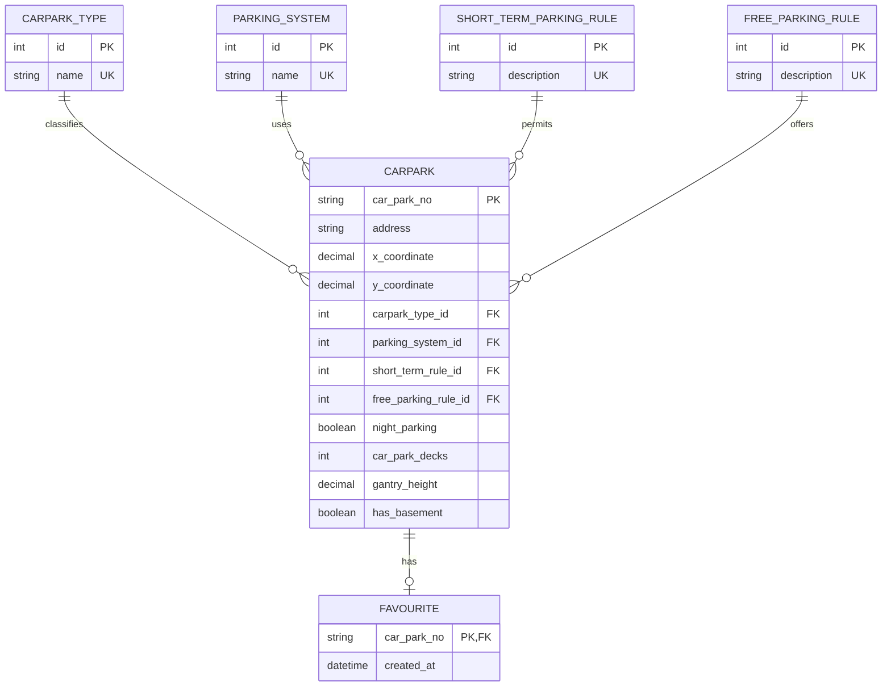

# Carpark Info API

ASP.NET Core 6 Web API implementation for the HDB carpark information assignment.

## Tech Stack

- ASP.NET Core 6
- Entity Framework Core 6
- SQLite
- Swagger/OpenAPI
- xUnit

## Run

```powershell
cd CarparkInfoApi
dotnet run --project .\src\CarparkInfo.Api\CarparkInfo.Api.csproj
```

Swagger is available at:

```text
https://localhost:<port>/swagger
```

## Import CSV

The import is transactional. If any row fails validation, the entire file is
rolled back.

Place the supplied CSV file in a local `data` folder:

```text
CarparkInfoApi/
  data/
    hdb-carpark-information-20220824010400.csv
```

```powershell
dotnet run --project .\src\CarparkInfo.Api\CarparkInfo.Api.csproj -- --import ".\data\hdb-carpark-information-20220824010400.csv"
```

The same import service is also exposed through the API:

```http
POST /api/imports/carparks?filePath=.\data\hdb-carpark-information-20220824010400.csv
```

## Testing With Swagger

Use this method when you want to manually test the API in a browser.

### 1. Start the API

```powershell
cd CarparkInfoApi
dotnet run --project .\src\CarparkInfo.Api\CarparkInfo.Api.csproj
```

The terminal will show the local URLs used by the API, for example:

```text
Now listening on: https://localhost:7xxx
Now listening on: http://localhost:5xxx
```

Open Swagger in your browser by adding `/swagger` to the HTTPS URL:

```text
https://localhost:7xxx/swagger
```

If the browser shows a local development certificate warning, continue to the
site. This is normal for local ASP.NET Core development.

### 2. Import the CSV

Before searching carparks, load the provided dataset.

In Swagger:

1. Open `POST /api/imports/carparks`.
2. Click `Try it out`.
3. Enter this value for `filePath`:

```text
.\data\hdb-carpark-information-20220824010400.csv
```

4. Click `Execute`.

Expected result:

```json
{
  "rowsImported": 2181
}
```

If Swagger returns `400 Bad Request`, check that the CSV file path is correct.
The import runs inside one database transaction, so a failed import will not
partially save rows.

### 3. Test carpark filtering

In Swagger:

1. Open `GET /api/carparks`.
2. Click `Try it out`.
3. Use these sample query values:

```text
hasFreeParking: true
hasNightParking: true
minimumVehicleHeight: 2.1
```

4. Click `Execute`.

Expected result:

- Status code `200`
- Response body contains a JSON array of carparks
- Each returned carpark has a non-`NO` `freeParking` value
- Each returned carpark has `nightParking` set to `true`
- Each returned carpark has `gantryHeight` greater than or equal to `2.1`

### 4. Test global favourites

Use an existing carpark number from the imported data, such as `ACM`.

Add a favourite:

1. Open `POST /api/favourites/{carParkNo}`.
2. Click `Try it out`.
3. Enter:

```text
ACM
```

4. Click `Execute`.

Expected result:

```text
204 No Content
```

List favourites:

1. Open `GET /api/favourites`.
2. Click `Try it out`.
3. Click `Execute`.

Expected result:

- Status code `200`
- Response body contains `ACM`

Remove the favourite:

1. Open `DELETE /api/favourites/{carParkNo}`.
2. Click `Try it out`.
3. Enter:

```text
ACM
```

4. Click `Execute`.

Expected result:

```text
204 No Content
```

### 5. Test invalid favourite handling

In Swagger:

1. Open `POST /api/favourites/{carParkNo}`.
2. Click `Try it out`.
3. Enter:

```text
UNKNOWN
```

4. Click `Execute`.

Expected result:

```text
404 Not Found
```

## API

### Search carparks

```http
GET /api/carparks?hasFreeParking=true&hasNightParking=true&minimumVehicleHeight=2.1
```

Filters:

- `hasFreeParking`: when `true`, excludes rows where `free_parking` is `NO`
- `hasNightParking`: matches the `night_parking` flag
- `minimumVehicleHeight`: returns carparks with `gantry_height` greater than or
  equal to the requested vehicle height

### Global favourites

```http
GET /api/favourites
POST /api/favourites/{carParkNo}
DELETE /api/favourites/{carParkNo}
```

Favourites are global for this assignment. Authentication and user-specific
favourites can be added later as an extension.

## Normalized ERD



## Test

```powershell
dotnet test .\CarparkInfo.sln
```
