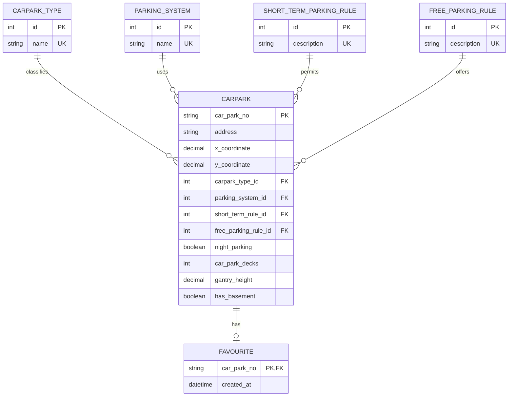

# Carpark Info ERD Design

## Normalized Model

The CSV contains repeated categorical values for carpark type, parking system,
short-term parking, and free-parking rules. These values are normalized into
lookup tables so the main carpark table stores stable foreign keys instead of
duplicated strings.

Boolean-style attributes such as night parking and basement availability remain
on the `Carpark` table because they describe the carpark directly and do not
need separate lookup tables.

## Tables

### `Carpark`

Stores one row per carpark from the CSV. The original `car_park_no` is the
primary key because it is already a stable business identifier.

### `CarparkType`

Stores distinct `car_park_type` values such as `SURFACE CAR PARK` and
`MULTI-STOREY CAR PARK`.

### `ParkingSystem`

Stores distinct `type_of_parking_system` values such as `COUPON PARKING` and
`ELECTRONIC PARKING`.

### `ShortTermParkingRule`

Stores distinct `short_term_parking` descriptions such as `WHOLE DAY`,
`7AM-10.30PM`, and `NO`.

### `FreeParkingRule`

Stores distinct `free_parking` descriptions such as `NO` and
`SUN & PH FR 7AM-10.30PM`.

### `Favourite`

Stores the global favourite carpark list required by the user story. It is not
part of the CSV import, but it references `Carpark` so favourites cannot point
to unknown carparks.

## Normalization Notes

- Repeated descriptive attributes are moved into lookup tables.
- `night_parking` is represented as a boolean because the CSV only contains
  `YES` or `NO`.
- `car_park_basement` is represented as `has_basement` because the CSV only
  contains `Y` or `N`.
- `x_coord`, `y_coord`, `car_park_decks`, and `gantry_height` stay on `Carpark`
  because they are scalar facts about a single carpark.
- The design is in 3NF for the information provided by the CSV without
  over-normalizing parking-rule text into guessed day/time structures.
